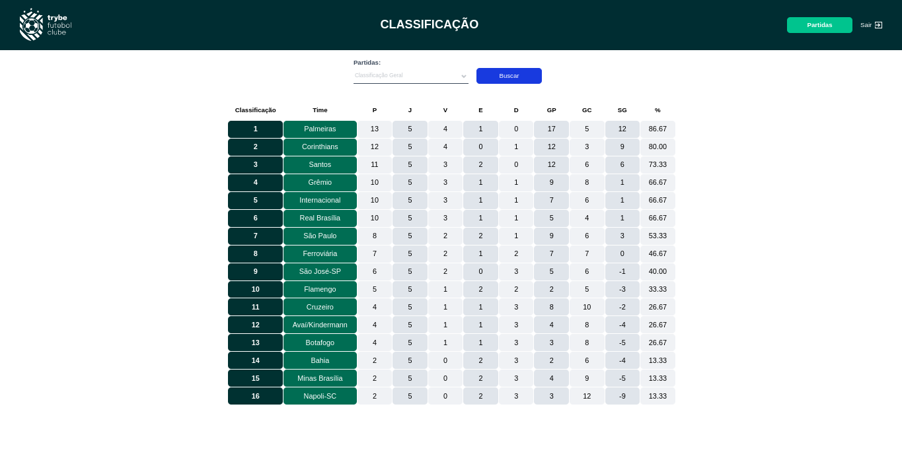

# Trube Futebol Clube



# Índice

* [Título e Imagens Home](#trube-futebol-clube)
* [tecnologias utilizadas](#tecnologias-utilizadas)
* [Descrição do projeto](#descrição-do-projeto)
* [Status do Projeto](#status-do-projeto)
* [Funcionalidade do projeto](#🔨-funcionalidade-do-projeto)
* [Acesso ao Projeto](#acesso-ao-projeto)

# Tecnologias utilizadas


# Descrição do Projeto

O projeto "Trube Futebol Clube" é parte do currículo da formação de Desenvolvedor Web da [Trybe](https://www.betrybe.com/). Nesse projeto, os alunos têm a oportunidade de aplicar seus conhecimentos uma Aplicação FullStack que testa conhecimentos em um API Rest Full TypeScript, criptografia de senha e geração de token, aplicação Frontend com React. 

# Status do Projeto

> 💹 Alpha 💹

# 🔨 Funcionalidade do projeto

- Ordena a Tabela por Pontuação Geral
- Ordena a Tabela por melhores Pontuadores com Mandantes
- Ordena a Tabela por melhores Pontuadores com Visitantes
- Fazer Login com
    Email: ```admin@admin.com```
    Senha: ```secret_admin```
- Editar um Partida em andamento
- Finalizar uma Partida em andamento
- Iniciar uma Nova Partida
- Filtra partidas em andamento
- filtra partidas finalizadas
- lista todas as partidas

# Acesso ao projeto

Para acessar e executar este projeto, siga os passos abaixo:

1. Certifique-se de ter o Node.js e o npm instalados em sua máquina.

2. Clone o Projeto

```bash
git clone https://github.com/EversonDias/Full_Stack_Trybe_Futebol_Clube_with_React_TypeScript_JWT_Bcrypt_MySQL_Docekr.git TrybeFutebolClub
```

3. Entre no projeto

```bash
cd TrybeFutebolClub
```

4. inicie o projeto

```bash
docker-compose up -d
```

A aplicação vai rodar na porta

```bash
http://localhost:3000
```
